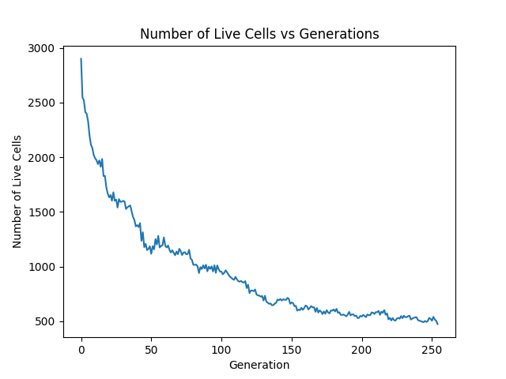

    

This is the term paper 1 for Modelling Complex Systems (idc621). I have chosen Conway's Game of Life as a model for my submission. I have done some tweaks to it. I have  recorded some interesting initial states, like the one above (spells GAME OF LIFE). This is an interactive zero-player game, so feel free to set different initial states and try it out yourself. Heres the number of live celss vs the generation of this initial state.

    

# Conway's Game of life

Or simply known as Life is a zero-player game, cellular automaton devised by British mathematician John Horton Conway in 1970. It is an incredible model because of how simple it is. He manages to exlpain a whole universe of life in three extremely simple rules.

## Rules

The first thing you should know when you talk of a game is what it is and whats its rules are. The universe of the game of life is an infinite, two-dimensional orthogonal grid of square cells, each of which is in one of the two possible states, live(1) or dead(0) (or on or off). The life of a cell is completely dependent on the neighbours (defined next) of it.

- Rule 1: Any live cell with less than two live neigbours dies by *Underpopulation*

- Rule 2: Any live cell with two or three live neighbours lives on to the next generation.

- Rule 3: Any live cell with more than three live neighbours dies by *Overpopulation*

- Rule 4: Any dead cell with exactly three live neighbours becomes a live cell *Reproduction*

*Life* breaks life down to extremely simple and essential parts. Like *Yayoi Kusama* once said: "Bring on Picasso, bring on Matisse, bring on anybody! I would stand up to them all with a single polka dot!". She aims to create art that makes people experience infinity, with just polka dots. 

What we learn here is that however complex a problem maybe, it can be broken down to its core elements, and it is these elements inform the creative process.

## Neighbourhoods

There are two kinds of neighbourhoods; Moore and von Neumann neighbourhood. Moore neighbourhood consists or all the eight cells surrounding the central cell (i,j).

1. Moore Neighbourhood: In cellular automata, the Moore neighborhood is defined on a two-dimensional square lattice and is composed of a central cell and the eight cells that surround it. [[wikipedia]](https://en.wikipedia.org/wiki/Moore_neighborhood)

    

2. Von Neumann Neighbourhood: In cellular automata, the von Neumann neighborhood (or 4-neighborhood) is classically defined on a two-dimensional square lattice and is composed of a central cell and its four adjacent cells. Here is an example of Von Neumann neighbourhood of a cell with a radius of 3. [[wikipedia]](https://en.wikipedia.org/wiki/Von_Neumann_neighborhood)

    

There are other very interesting neighbourhoods that are used in different systems that are extensions of these with different radii. You can refer to [this](https://www.researchgate.net/publication/333524697_Mechanisms_for_Cell-to-cell_and_Cell-free_Spread_of_HIV-1_in_Cellular_Automata_Models) if you want to know more.

## Why these rules?

Conway went thought many other rules and settled on this [youtube](https://www.youtube.com/watch?v=R9Plq-D1gEk). There are as many combinations of rules as there are combinations of numbers to use for determining when a cell lives or dies. Now we do not want cells to die out *too quickly* nor do we want them to live on forever. So the criteria followed by Conway were [[more details]](https://pi.math.cornell.edu/~lipa/mec/lesson6.html):

- There should be no initial pattern for which there is a simple proof that the population can grow without limit.

- There should be initial patterns that apparently do grow without limit.

- There should be simple initial patterns that grow and change for a considerable period of time before coming to an end in the following possible ways:

    1. Fading away completely (from overcrowding or from becoming too sparse)

    2. Settling into a stable configuration that remains unchanged thereafter, or entering an oscillating phase in which they repeat an endless cycle of two or more periods.

# Interesting patterns

Here are some very interesting patterns that I observed while the simulation was running, at different initial states and some pre-known initial states. 

Common pattern types include: still lifes, which do not change from one generation to the next; oscillators, which return to their initial state after a finite number of generations; and spaceships, which translate themselves across the grid.

1. Still Lifes: block, beehive, loaf, boat, tub

- Block

    
    
<em>block</em>

- Beehive

    
    
<em>beehive</em>

- Loaf

    
    
<em>loaf</em>

- Boat

    
    
<em>boat</em>

- Tub

    
    
<em>tub</em>

2. Oscillators: blinker, toad, beacon, pulsar, pentadecathlon

- Blinker

    
    
<em>Blinker (period 2)</em>

- Toad

    
    
<em>Toad (period 2)</em>

- Beacon

    
    
<em>Beacon (period 15)</em>

- Pulsar

    
    
<em>pulsar (period 3)</em>

    
    
<em>Population vs generation for a Pulsar</em>

- Pentadecathlon

    
    
<em>pentadecathlon (period 15)</em>

    
    
<em>Population vs generation for a pentadecathlon</em>

3. Spaceships: glider, lightweight spaceship (LWSS), middleweight spaceship(MWSS), heavyweight spaceship (HWSS)

- Glider

    
    
<em>Glider</em>

    
    
<em>Population vs generation</em>

- Light weight spaceship (LWSS):

    
    
<em>Light weight spaceship</em>

As you can see something really interesting happens because of the boundary conditions. I have used fixed boundary conditions, where the cells after the boundary are ingnored, as a consequence, the LWSS went ahead and made a glider when it hit the boundary.

## Gosper's glider: 

    
    
<em>Gosper's Glider Gun</em>

    
    
<em>Population vs generation</em>

# Unpredictability

A large number of generations leads to either extinction, infinite evolution or some stable state. Most of the patters in Game of Life eventually just become a combination of still lifes, oscillators and spaceships. Or they can become chaotic. If we run a state for a billion generations and it seems to be ever evolving, it can die in the next state. So it is very unpredictable to tell if the state will run forever or die off given the initial pattern and a later pattern.

*Fun Fact*: Conway's Game of Life was built on a 'Go' board for the first time.

## Randomly generated initial state:

A randomly generated initial state will obviously have an unpredictable result. Here's one such run.

    
    
<em>A random initial state</em>

We can clearly see that the population decreases significantly yet not so much to go extinct, but reaches a quite steady state with some oscillators, and very coomon still lifes. The observation is clearly seen in the population vs generation plot below. If you carefully observe youo can see that the gradient of colours is very gradual and the inheritance pattern is visible. 

    
    
<em>Population vs generation</em>

## Perturbations to the system

As my code is an interactive one, I have the freedom to perturb it whenever I want. I can paint on a few live cells or kill a live cell. Here are some observations that have been through the perturbation.

    
    
<em>Adding a perturbation</em>

It is clearly visible when the perturbtion was added. An alternative is if you see a stable state then perturb the system with the mouse by disturbing the stability and making it either evolve or die or go back to the same or a different still state. Here is the plot of popultion vs generation.

    
    
<em>Population vs generation</em>

# The tweaks

I wanted to make the game window colorful. So thiking along those lines, I have made a code for genetic component that the daughter cell chooses from its 8 parents (so we will have 256 possibilities). I added color as a trait that is chosen randomly.

## Modified rules

Here are the modified rules for the genetic model of Conway's game of life. I have kept all the rules from the *life* as it is and added these changes to it.

1. Random Inheritance from Neighbors: 
- A daughter cell, if born, from exactly three neighbours, randomly inherits colors from two live neighbours (dominant parents).
- The color of both is blended together to create the daughter. To do this, I took the average of values of the (R,G,B) values.

2. Color as a trait: Each live cell has a particular color that it passes on to the next generation by random inheritance.

3. Colors that survive keep the color. That is, a live cell with 2 or 3 neighbours, keeps its original color.

## Random generation

The simulation with color is extremely beautiful and insightful to look at. And tells us about the inheritance of dominant trait (color).

    
    
<em>Random generation</em>

And accordingly heres the plot of population vs generation.

    
    
<em>Population vs generation</em>

And here is another more contrasting color schemed random generation (just because its pretty). If you notice carefully, one can see the localised colors.

Some other observations are:
- As the new cells are born we can see a dynamics evolution of color.
- This might also lead us to see a gradient across the game window.
- We also see patches (localised) of genes.
- Higher the population, higher is the blending of color and vice versa.
- If a live cell surviews for multiple generations, the color of the cell remains unchanged for long periods and may become into a dense solid color pocket if a few neighbouring cells are also staying alive from a long period of time.
- As the selection of live cells is a random generation, and the selection of color of the cells is a random generation, it can lead to a much more unpredictable result, hence more random. And might not be reproducible.
- If a region is alive for a while then the colors become belnded and less distinct. Much like what happens in inheritance of genes.

    
    
<em>Random generation</em>

And again accordingly heres the plot of population vs generation.

    
    
<em>Population vs generation</em>

# Applications

- Cellular Automata has applications in all fields of science. For instance, plants regulate their intake and loss of gases via a cellular automaton mechanism. Each stoma on the leaf acts as a cell. [wikipedia](https://en.wikipedia.org/wiki/Cellular_automaton#Applications)

- In physics, it is used in the ising model, where eaach cell is in either "up" state or "down" state, amking an idealized representation of a magnet.

- It is also used to simulate fluids, as they obey laws of thermodynamics.

- Game of life is used for modelling complex systems, that are non-linear in all fields of science eg: metrology, cosmology, engineering.

- The patterns of stability will arise but will be veyr hard to predict. This helps us understand the chaotic behaviour.

- It is used to observe data, model system, tweak systems. In the read about a few other ideas like quantum game of life, energy states, phase transitions.

# References

[1] John Conway: Inventing Game of Life
https://www.youtube.com/watch?v=R9Plq-D1gEk

[2] What creativity and Conway's Game of Life have in common https://medium.com/art-direct/what-great-art-and-conways-game-of-life-have-in-common-4e9b5b78c19c

[3] Conway's Game of Life https://pi.math.cornell.edu/~lipa/mec/lesson6.html

[4] STack exchange https://math.stackexchange.com/questions/1536288/what-are-the-practical-uses-of-game-of-life-or-langtons-ant